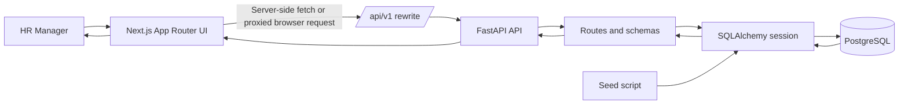

# Architecture And Request Flow

## High-level architecture

I kept the system as a three-tier application with clear boundaries:

- Next.js is the presentation layer.
- FastAPI is the application and API layer.
- PostgreSQL is the persistence layer.

I also used Docker Compose at the repository root so the system can be started as a single local stack while still allowing the backend and frontend to evolve as separate applications.

## Why this shape

This structure fits the assessment well because it is easy to reason about, easy to run locally, and realistic enough to demonstrate API design, data modeling, migration handling, and UI composition in one codebase.

I also chose a Git submodule-oriented layout for the frontend and backend. My intent was to keep each application independently developable while still presenting the assessment as one cohesive deliverable. In practice, that means the root repository owns orchestration concerns such as Docker Compose, shared setup, and high-level documentation, while each application can remain cleanly scoped to its own stack.

I think this is a good fit here because it balances two competing goals:

- reviewers can clone one parent repository and run the whole system end to end
- the frontend and backend still read like separate deployable units rather than one tightly coupled monolith

The main trade-off is operational overhead: submodules add a bit of Git ceremony for cloning, updating, and onboarding. I accepted that because the separation itself was valuable to demonstrate, and the root-level setup instructions make that overhead manageable for an assessment reviewer.

## Request and data flow

## Component responsibilities

### Frontend

The frontend is responsible for layout, server-rendered page composition, and display formatting. It does not own business rules for salaries or employee analytics. That logic stays in the API.

I used a small API client layer so page components do not need to know how URLs are resolved in browser versus server contexts. The same-origin rewrite also keeps browser requests simple.

### Backend

The backend is responsible for:

- CRUD operations on employees
- Search and pagination
- Salary overview metrics
- Grouped insights by country, department, job title, and tenure
- Hiring trend calculations

I kept these responsibilities in the API service rather than duplicating logic in the frontend.

### Database

PostgreSQL is more than storage here. I used it to enforce constraints and support performance-sensitive paths:

- `pgcrypto` for UUID generation
- `pg_trgm` plus a GIN index for full name search
- a computed `full_name` column
- indexes for common filter and grouping dimensions
- a trigger to maintain `updated_at`

## Deployment and environment notes

The frontend resolves API URLs differently depending on runtime:

- On the server, it can call the backend directly using `INTERNAL_API_URL`.
- In the browser, it uses same-origin `/api/v1` requests that Next.js rewrites to the backend.

I chose this because it avoids hard-coding backend hosts into browser code while still letting server-rendered pages call the API efficiently in Docker or local development.

## Architectural boundaries I intentionally kept

I did not introduce a service layer, repository layer, or event-driven messaging inside the backend because the current domain is still small. The routes, models, and query helpers are enough for the assessment scope and are easier to review quickly.